# Serverless ETL Pipeline on AWS (S3, Lambda, Glue, Athena)

# 📖 Project Overview
This project demonstrates how to build a **serverless ETL (Extract, Transform, Load) pipeline** on AWS.  
The pipeline processes **incoming JSON order data**, transforms it into a query-friendly format, and makes it available for analysis using **Amazon Athena**.  

This use case mirrors common real-world scenarios in **data analytics and data engineering**, where raw data needs to be cleaned, structured, and analyzed at scale.  

---

## 🏗️ Architecture

```mermaid
flowchart LR
    A[📂 S3 Incoming Orders Folder] -->|Trigger| B[🟦 AWS Lambda]
    B --> C[📂 S3 Staging Folder]
    C --> D[🗂️ AWS Glue Crawler & Database]
    D --> E[🔍 Athena ]
```

---

## 📌 Use Case & Industry Relevance

This pipeline reflects a **simple data engineering workflow**: taking **semi-structured data** (JSON), transforming it into a **query-optimized format** (Parquet), and making it available for **analytics and reporting**.  

Potential applications include:  
- **E-commerce & Retail** – processing customer order data for sales dashboards and inventory tracking.  
- **Logistics & Supply Chain** – ingesting shipment or tracking events for operational visibility.  
- **Finance** – normalizing transaction data for compliance reporting and trend analysis.  
- **Healthcare** – flattening nested medical record data into structured tables for research and BI tools.  

In short, any industry that collects **event-driven, nested JSON data** can benefit from this type of pipeline to quickly enable insights without heavy infrastructure.  

---

## 🛠️ How to Reproduce

Follow these steps to build the pipeline yourself:  

### 1. Create S3 Bucket and Folders
- Create a new **S3 bucket** (e.g., `my-etl-pipeline-bucket`).  
- Inside the bucket, create two folders:  
  - `incoming_orders/` → for raw JSON uploads.  
  - `staging_orders/` → for transformed Parquet files.  

---

### 2. Deploy Lambda Function
- Create a new **AWS Lambda function** (Python runtime).  
- The function is configured to run **on-demand**, triggered whenever a new file is uploaded to the `incoming_orders/` folder in S3.  
- Add a **trigger** for the S3 bucket → set it to fire on **ObjectCreated** events in the `incoming_orders/` folder.  
- Set the **Lambda timeout** to at least **30 seconds** (default is 3 seconds), or the transformation code may time out before finishing.  

- Attach an **IAM Role** with permissions for:  
  - `s3:GetObject`, `s3:PutObject`  
  - `glue:*` (for crawler and catalog)  
  - `logs:*` (for debugging)  

- Upload the `transform.py` script from this repo into Lambda.  
- Add a **Lambda layer** containing the **Pandas** library so the function can:  
  - Read JSON files.  
  - Flatten nested fields.  
  - Write out Parquet format to the `staging_orders/` folder.  
---

### 3. Configure AWS Glue
- Create a **Glue Database** (e.g., `orders_db`).  
- Set up a **Glue Crawler**:  
  - Data source → point it to the S3 `staging_orders/` folder.  
  - Output → select the Glue database created above.  
  - Run the crawler to detect schema and create a table (e.g., `orders_parquet`).  

---

### 4. Query with Amazon Athena
- Open **Athena** and connect it to the Glue Data Catalog.  
- Select the database and run SQL queries against the table.  

